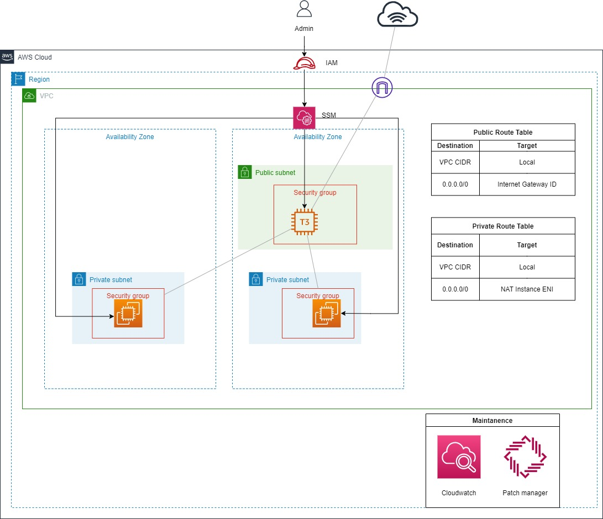

# terraform-ec2-nat-instance

This repo is a fork from [Ken Helbert's terraform-ec2-nat-instance](https://github.com/kenhalbert/terraform-ec2-nat-instance)

I decided to fork from his repo because of the brevity. Nevertheless, some infrastructure designs took inspirations from [int128's terraform-aws-nat-instance](https://github.com/int128/terraform-aws-nat-instance)

For production, please use NAT Gateway.

# Basic Design

- Refer basic_example folder
- T3 nano instance for NAT instance, because regardless of size, T3 gives network of 5 Gigabit anyways, so might as well use the smallest one for cost-saving
- While there are other EC2 instance families with network Gigabit of more than 5, T3 is still most cost-effective. For example, an A1 medium, which has 10 Gigabit, is around 6 times more expensive than a T3 nano.
- SSM for NAT instance (Better security, no need to open port 22 and rely on SSH key)
- Amazon Linux 2 for AMI, because it already comes with SSM installed
- Patch manager is for automatic security patches

# Changes made compared forked repo
1. Add more variables and reduce hard-coded values.
    - region_id
2. Rename variables to be more specific
    - name -> nat_instance_name
    - ami_id -> nat_instance_ami_id
    - security_group_ingress_cidr_ipv4 -> nat_instance_security_group_ingress_cidr_ipv4
    - ssh_key_name -> nat_instance_ssh_key_name
    - public_subnet_id -> nat_public_subnet_id
3. Fix Internet connectivity in private instance
    - Tested original code in US-East-1 region, but private instance could not ping google.com
    - Now use [these two lines from this blog post](https://www.kabisa.nl/tech/cost-saving-with-nat-instances/#the-ec2-instance) instead
    - Also [disable source/destination check as recommended](https://www.kabisa.nl/tech/cost-saving-with-nat-instances/#disable-sourcedestination-check)

# Experimental design

- Refer to experimental folder
- Autoscaling group allows scaling up if any metric related to network or CPU exceed 90%, as well as scaling down if all network and CPU metrics are less than 60%.
- Scaling event send SNS notifications to lambda, which will do three things:
    1. Update private route table: Delete or add route for ENI of scaled instance
    2. Update cloudwatch dashboard: Delete or add dashboard for scaled instance
    3. Send message to discord: Based on the updates to route table and cloudwatch
- Before running the terraform code for this design, two things need to be done first:
    1. Add Discord webhook key to AWS secret manager
    2. Add the Docker image built from the docker folder to an ECR repository (follow the push commands given by AWS)